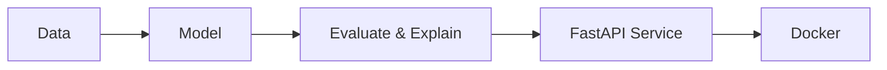

[README.md](https://github.com/user-attachments/files/32960700/README.md)

 

---

### ⚡ About Me

- 🧠 I care about the full path of a model: **train it, explain it, serve it behind an API, containerize it.**
- 🔍 I prefer models that show their reasoning. My imaging work uses **Grad-CAM** to check *where* a network looks, not only how accurate it is.
- 🎬 Most of my work sits in **computer vision, NLP, and recommendation systems**, with **FastAPI + Docker** as the delivery layer.
- 🌾 Side curiosity: **IoT sensing for agriculture** and **reinforcement learning for control problems**.

---

### 🔄 How I Build

---

### 🛠️ Tech Stack

**Core**

 

**Frontend**

**Currently learning**

---

### 🌟 Featured Projects

| Project | Problem | Approach | Stack |
|---|---|---|---|
| 🧠 **[Brain Tumor MRI Detection](https://github.com/mahtabkarami/REPO_NAME)** | Classify tumors from MRI scans and make the decision inspectable | CNN with **Grad-CAM** heatmaps | `TensorFlow` `Keras` |
| 🌿 **[Plant Disease Detection](https://github.com/mahtabkarami/REPO_NAME)** | Identify crop leaf diseases from images | **Transfer learning** on MobileNetV2 | `TensorFlow` `MobileNetV2` |
| 🎬 **[Movie Recommender](https://github.com/mahtabkarami/REPO_NAME)** | Suggest relevant titles in a Netflix-style experience | Recommendation pipeline exposed through a REST API | `Python` `FastAPI` |
| 💬 **[Sentiment Analysis Pipeline](https://github.com/mahtabkarami/REPO_NAME)** | Turn raw text into sentiment predictions | Reproducible end-to-end NLP pipeline | `Python` `Scikit-learn` |
| ▶️ **[YouTube Summarizer Bot](https://github.com/mahtabkarami/REPO_NAME)** | Summarize long videos automatically | Team project. I owned the **backend, API design, and Docker deployment** | `FastAPI` `Docker` |
| 🗂️ **[XRM-ME Frontend](https://github.com/mahtabkarami/REPO_NAME)** | A maintainable CRM/ERP interface | Feature-folder architecture, modules built incrementally | `Next.js` `TypeScript` |

---

### 🎯 Currently

| | |
|---|---|
| 🔭 **Building** | XRM-ME (Projects module) |
| 🌱 **Learning** | PyTorch · LLMs · RAG · LangChain |
| 🗄️ **Practicing** | SQL / T-SQL |
| 📖 **Reading** | Papers on computer vision and reinforcement learning |

---

### 💬 Ask Me About

`Grad-CAM` · `Transfer learning` · `Recommender systems` · `Serving ML with FastAPI` · `Dockerizing ML services`

---

### 📊 GitHub Stats

---

Open to discussing machine learning, computer vision, and applied AI engineering.

  

