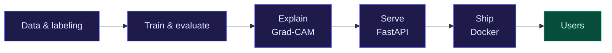

<div align="center">

  

  <br>

  <a href="https://readme-typing-svg.demolab.com/">
    
  </a>

  <p>
    I build practical AI/ML systems and the software around them,<br>
    from models and APIs to deployment.
  </p>

  <a href="https://www.linkedin.com/in/mahtab-karami-052658249">
    
  </a>
  <a href="mailto:m.karami1383@gmail.com">
    
  </a>
  <a href="https://github.com/mahtabkarami?tab=repositories">
    
  </a>

  <br><br>

  
  

</div>

---

## About

My work sits where **machine learning meets software engineering**.

I'm particularly interested in **Computer Vision, Deep Learning, NLP, and AI-powered applications**, with a strong focus on making models useful beyond a notebook: exposing them through APIs, integrating them into applications, and getting them running in practical environments.

I'm a computer science undergraduate, and I like the part where an ML idea has to survive contact with real software: inputs that are messy, users who don't read docs, and a deployment that has to stay up.

<details>
<summary><b>How I work</b> (click to expand)</summary>

<br>

- **Explain the model, don't just score it.** I add explainability (Grad-CAM) to vision projects so predictions can be inspected, not just trusted.
- **Measure before claiming.** I report accuracy, precision, recall, F1, mAP and confusion matrices rather than a single headline number.
- **Ship it.** If a model can't be called through an API or opened in a browser, I treat the project as unfinished.

</details>

## Currently

| | |
|---|---|
| 🔨 **Building** | A multimodal plant disease app: image + metadata classifier, Grad-CAM heatmaps, and LLM-generated explanation and treatment advice (Streamlit + FastAPI) |
| 🎓 **Researching** | Deep-learning-based plant disease detection |
| 🎯 **Looking for** | AI/ML engineering internships and entry-level roles; graduate programs in the US and Europe |

## From idea to product



## Tech Stack

### AI / ML

<p>
  
</p>


### Backend & Infrastructure

<p>
  
</p>


### Web

<p>
  
</p>

## Projects

### Featured

<table>
<tr>
<td width="50%" valign="top">

#### 🧠 Brain Tumor MRI Detection
`TensorFlow` `Keras` `Grad-CAM` `Streamlit` `Docker`

CNN classifier for MRI scans. Grad-CAM heatmaps show which image regions drive each prediction. Containerized and deployed on Hugging Face Spaces.

<!-- TODO: add live demo + repo links, and your real accuracy / recall / F1 -->

</td>
<td width="50%" valign="top">

#### 🌿 Plant Disease Detection
`TensorFlow` `MobileNetV2` `TFLite` `FastAPI` `Streamlit`

Leaf disease classification with MobileNetV2 transfer learning, converted to TensorFlow Lite. The MVP version adds metadata fusion, Grad-CAM, and an LLM that writes the explanation and treatment advice.

<!-- TODO: add demo + repo links and your real metrics -->

</td>
</tr>
</table>

### More work

<details>
<summary><b>🎬 Recommender systems</b> · <code>Python</code> <code>Scikit-learn</code> <code>FastAPI</code></summary>

<br>

- **Movie recommender**: Netflix-style recommender behind a FastAPI backend, with documented architecture and API.
- **MovieLens project**: collaborative and content-based filtering with SVM, plus a second system built on clustering.

</details>

<details>
<summary><b>🗣️ Sentiment Analysis Pipeline</b> · <code>Python</code> <code>Scikit-learn</code></summary>

<br>

Text classification pipeline from preprocessing to prediction.

</details>

<details>
<summary><b>▶️ YouTube Summarizer Bot</b> · <code>FastAPI</code> <code>Docker</code> <code>Whisper</code> <code>LLM</code></summary>

<br>

Team project: a Telegram bot that summarizes YouTube videos (Whisper transcription + LLM). I designed the backend API and handled Docker deployment.

</details>

<details>
<summary><b>🌾 Crop monitoring with YOLO</b> · <code>YOLO</code> <code>Roboflow</code> <code>OpenCV</code></summary>

<br>

Object-detection-based crop monitoring system.

</details>

<details>
<summary><b>🕯️ Descent in Shadows</b> · <code>FastAPI</code> <code>SQLAlchemy</code></summary>

<br>

Collaborative text-based horror/adventure game. I'm a backend engineer on the team: API development and database integration.

</details>

<details>
<summary><b>🧩 XRM-ME</b> · <code>Next.js</code> <code>TypeScript</code> <code>Playwright</code></summary>

<br>

CRM/ERP frontend organized by feature folders. The Projects module is in development.

</details>

## What I'm Building

- AI/ML applications with practical use cases
- Backend APIs that expose and support ML systems
- Computer Vision and multimodal projects
- AI-powered tools using local and cloud-based models
- Applications where model development and software engineering meet

## Focus Areas

`Deep Learning` · `Computer Vision` · `NLP & LLMs` · `Multimodal AI` · `Backend APIs` · `Model Deployment`

---

## Areas of Interest

```text
Machine Learning
├── Computer Vision and model explainability
├── NLP and LLM applications
├── Recommender systems
└── Multimodal AI

Engineering
├── ML-serving APIs
├── Containerized deployment
├── Full-stack applications
└── IoT sensing for agriculture (exploring)
```

---

## GitHub

<p align="center">
  
  
</p>

---

<div align="center">

### Find me here

<a href="https://www.linkedin.com/in/mahtab-karami-052658249">LinkedIn</a>
&nbsp;&nbsp;·&nbsp;&nbsp;
<a href="mailto:m.karami1383@gmail.com">Email</a>
&nbsp;&nbsp;·&nbsp;&nbsp;
<a href="https://github.com/mahtabkarami?tab=repositories">Repositories</a>

</div>
